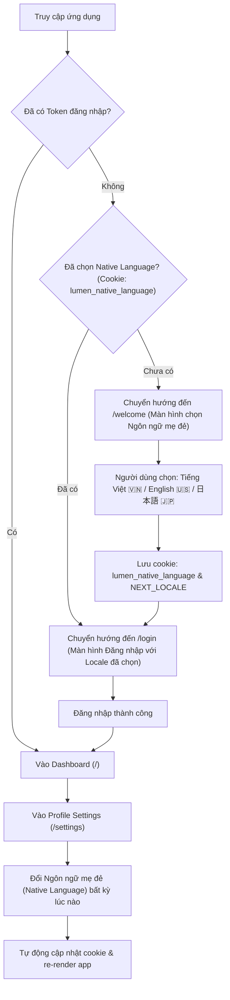

# Tài Liệu Đặc Tả: Native Language Onboarding & Japanese Support (Ngôn Ngữ Mẹ Đẻ)

## 1. Mục Tiêu & Bối Cảnh (Context & Goals)
Đối với ứng dụng học ngôn ngữ (như Lumen), người dùng lần đầu truy cập chưa có dữ liệu cá nhân hay tài khoản. Để đem lại trải nghiệm cá nhân hóa tốt nhất:
1. **Lần đầu tiên truy cập (First-time visitor)**: Hệ thống cung cấp màn hình lựa chọn **Ngôn ngữ mẹ đẻ (Native Language)** trước khi đưa người dùng vào màn hình Đăng nhập (`/login`).
2. **Hỗ trợ thêm Tiếng Nhật (`ja`)**: Mở rộng hệ thống bản dịch đa ngôn ngữ sang tiếng Nhật bên cạnh tiếng Việt (`vi`) và tiếng Anh (`en`).
3. **Cài đặt cá nhân (Profile Settings)**: Cập nhật mục "Ngôn ngữ" thành **"Ngôn ngữ mẹ đẻ (Native Language)"**, cho phép người dùng thay đổi bất kỳ lúc nào và tự động lưu vào cookie/preference.

---

## 2. Luồng Người Dùng (User Flow)

---

## 3. Chi Tiết Kỹ Thuật (Technical Specifications)

### 3.1. Chiến Lược Lưu Trữ Đa Nền Tảng (Cross-Platform / Mobile & Web Strategy)
Để đảm bảo **100% tương thích cả Web lẫn Mobile App (React Native/Flutter/iOS/Android)** mà không bị phụ thuộc vào Cookie của trình duyệt:

1. **Tầng Lưu Trữ Client (Local Storage)**:
   - **Web**: Sử dụng `localStorage` với key chuẩn `lumen_native_language`. Đồng thời đồng bộ sang cookie nhẹ chỉ để phục vụ Next.js Server-Side Middleware (Edge runtime).
   - **Mobile**: Sử dụng `AsyncStorage` / `SecureStore` / `SharedPreferences` với cùng key chuẩn `lumen_native_language`. Mobile hoàn toàn không cần cookie.
2. **Tầng Giao Tiếp API (Request Headers)**:
   - Cả Web và Mobile đều gửi Header chuẩn trong mọi request gửi tới NestJS backend:
     `api-language: vi | en | ja` (hoặc `Accept-Language: vi | en | ja`).
3. **Tầng Profile Người Dùng (Backend Sync)**:
   - Khi người dùng đăng nhập thành công, trường `nativeLanguage` trong profile được đồng bộ 2 chiều:
     - Nếu user đổi ngôn ngữ trên máy $\rightarrow$ gọi API cập nhật profile.
     - Khi user đăng nhập trên máy mới (Web hoặc Mobile) $\rightarrow$ tự động nhận diện ngôn ngữ từ profile người dùng.

### 3.2. Phân Nhóm Route Tập Trung (Route Grouping)
Tách bạch rõ các nhóm route ngay tại `src/shared/constants/route.ts`:
- **`ONBOARDING_ROUTES = [RouteEnum.WELCOME]`**: Nhóm màn hình chào mừng / khảo sát ban đầu cho khách mới.
- **`PUBLIC_ROUTES = [RouteEnum.LOGIN, RouteEnum.WELCOME]`**: Nhóm màn hình công khai không yêu cầu token đăng nhập.
- **`APP_PROTECTED_ROUTES = [...]`**: Nhóm màn hình yêu cầu token đăng nhập (Dashboard, Study, Vocabulary, Settings...).

### 3.3. Cấu Hình Routing & i18n
- **`src/shared/i18n/routing.ts`**:
  - `locales`: `['en', 'vi', 'ja']`
  - `defaultLocale`: `'vi'`
- **`src/shared/i18n/messages/`**:
  - `vi.json`: Cập nhật mục `Settings.appearance.nativeLanguage` và `Auth.Welcome`.
  - `en.json`: Cập nhật mục `Settings.appearance.nativeLanguage` và `Auth.Welcome`.
  - `ja.json`: **Tạo mới** đầy đủ tất cả keys từ `en.json`/`vi.json` bằng tiếng Nhật chuẩn xác, tự nhiên.

### 3.4. Màn Hình Welcome (`/welcome`)
- **Tuyến đường**: `RouteEnum.WELCOME = '/welcome'`.
- **Giao diện**:
  - Đặt trong layout auth với hiệu ứng Silk/WebGL thương hiệu Lumen cao cấp.
  - Tiêu đề đa ngữ:
    - *Tiếng Việt*: "Chào mừng bạn đến với Lumen. Hãy chọn ngôn ngữ mẹ đẻ của bạn để bắt đầu."
    - *English*: "Welcome to Lumen. Choose your native language to get started."
    - *日本語*: "Lumenへようこそ。母国語を選択して始めましょう。"
  - Danh sách thẻ lựa chọn ngôn ngữ:
    1. 🇻🇳 **Tiếng Việt** (Vietnamese)
    2. 🇺🇸 **English** (Tiếng Anh)
    3. 🇯🇵 **日本語** (Japanese)
  - Nút bấm tiếp tục: `[ Tiếp tục / Continue / 次へ ]` chuyển hướng tới `/login`.

### 3.5. Middleware (`src/middleware.ts`)
- Sử dụng trực tiếp mảng `PUBLIC_ROUTES` từ `route.ts`.
- Kiểm tra trạng thái:
  - Nếu `!token && !nativeLanguage && !ONBOARDING_ROUTES.includes(normalizedPath)`: Chuyển hướng tới `/welcome`.
  - Nếu `token && ONBOARDING_ROUTES.includes(normalizedPath)`: Chuyển hướng tới `/` (dashboard).
  - Nếu `!token && normalizedPath === '/' && nativeLanguage`: Chuyển hướng tới `/login`.

### 3.6. Cập Nhật Trang Cài Đặt (`/settings`)
- Đổi nhãn `appearance.language` thành **"Ngôn ngữ mẹ đẻ" / "Native Language" / "母国語"**.
- Cập nhật `LanguageSwitcher` hỗ trợ hiển thị cờ 🇯🇵 và nhãn "日本語".
- Khi chuyển đổi ngôn ngữ trong `LanguageSwitcher`, tự động cập nhật `lumen_native_language` trong LocalStorage và Header.
