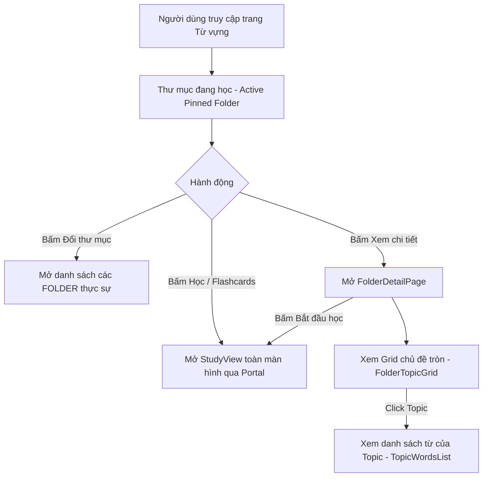

# Vocabulary System Architecture & Study Flow

Tài liệu chuẩn hóa kiến trúc hệ sinh thái Từ vựng (Vocabulary), phân định rõ ràng giữa **Folder (Thư mục học)** và **Topic (Chủ đề hiển thị)**, quy chuẩn cấu trúc cơ sở dữ liệu, phân rã Component kiến trúc và luồng học (Study Flow).

---

## 1. Định nghĩa Khái niệm Cốt lõi

### 1.1. Folder (Thư mục từ vựng) - Đơn vị Học tập (Study Container)

- **Bản chất**: Là đơn vị chứa từ vựng cấp cao nhất phục vụ cho việc **HỌC TẬP (Study & Review)**.
- **Quy mô**: Chứa toàn bộ các từ vựng thuộc một bộ học tập hoàn chỉnh (ví dụ: Thư mục hệ thống 600 từ vựng cốt lõi TOEIC, Thư mục phân loại theo cấp độ CEFR A0/A1/B1, hoặc Thư mục cá nhân do người dùng tạo).
- **Quy tắc luồng học**:
  - Khi người dùng nhấn **Học (Study / Flashcards)** hoặc **Ôn tập (Review)** một Folder: Hệ thống **BẮT BUỘC** đưa **TOÀN BỘ từ vựng** (hoặc toàn bộ từ đến hạn ôn tập của Folder đó) vào phiên học.
  - Việc chia nhỏ từng phiên được xử lý tự động qua quota (Dynamic Learning Queue) chứ không phân tách Folder thành nhiều mục nhỏ.

### 1.2. Topic (Chủ đề) - Đơn vị Hiển thị & Phân loại (View/Filter Only)

- **Bản chất**: Là thuộc tính metadata phân loại được lưu trữ trực tiếp trong cơ sở dữ liệu (`vocab_words.topic`, `vocab_words.topicVi`, `vocab_words.topicImageUrl`).
- **Mục đích**: **CHỈ PHỤC VỤ MỤC ĐÍCH XEM VÀ LỌC (View / Filter / Browse)**:
  - Cho phép người dùng duyệt từ vựng theo nhóm chuyên đề để tra cứu.
  - Xem danh sách từ vựng được nhóm theo Topic trong trang chi tiết Folder ([FolderDetailPage]).
  - Hiển thị avatar tròn minh họa chủ đề kèm vòng tiến độ ghi nhớ (Circular Progress Ring).
- **Ranh giới nghiêm ngặt**:
  - Topic **KHÔNG PHẢI** là một Folder.
  - Không bao giờ hiển thị Topic thành các Folder riêng lẻ trong giao diện "Đổi thư mục" (Switch Folder).
  - Tất cả tên chủ đề tiếng Anh, tên tiếng Việt và link ảnh minh họa được cung cấp 100% từ Database/API, tuyệt đối không hardcode file mapping ở client.

---

## 2. Quy chuẩn Luồng Học (Study Flow)



### 2.1. Active Pinned Folder (Thư mục đang học)

- Người dùng luôn có **1 Thư mục ghim đang học** tại một thời điểm.
- Mọi widget trên Dashboard (Thẻ tiến độ, Vòng lặp Spaced Repetition, Từ hay sai, Số từ cần ôn) đều phản ánh dữ liệu của **Toàn bộ Folder này**.

### 2.2. Switch Folder (Đổi thư mục)

- Khi bấm "Đổi thư mục": Giao diện **CHỈ HIỂN THỊ CÁC FOLDER LỚN**:
  1. Các Thư mục hệ thống (ví dụ: Thư mục 600 từ vựng TOEIC, Thư mục CEFR).
  2. Các Thư mục cá nhân do người dùng tự tạo.
- **Nghiêm cấm**: Hiển thị danh sách 50 topic con (như Trains, Eating Out, Shipping) trong modal đổi thư mục.

### 2.3. Folder Detail & Topic Viewing

- Trong trang xem chi tiết Folder ([FolderDetailPage]):
  - Chế độ 1: Grid các chủ đề tròn ([FolderTopicGrid]) với ảnh minh họa, tên Việt/Anh, số từ đã thuộc / tổng số từ, và vòng tiến độ SVG tròn.
  - Chế độ 2: Danh sách từ vựng ([TopicWordsList]) khi bấm vào 1 chủ đề cụ thể để nghe phát âm US/UK, xem nghĩa và câu ví dụ.
  - Nút hành động nổi dính đáy ([StudyBottomActionBar]) luôn sẵn sàng kích hoạt phiên học.

---

## 3. Cấu trúc Dữ liệu & Backend Mapping

### 3.1. Database Schema

- `vocab_folders`: Đại diện cho Thư mục học tập (`id`, `name`, `description`, `authorId`, `category`).
- `vocab_words`: Chứa thông tin từ vựng:
  - `topic`: Tên chủ đề tiếng Anh (ví dụ: `"Contracts"`, `"Salaries & Benefits"`, `"Banking"`...).
  - `topicVi`: Tên chủ đề tiếng Việt chuẩn có dấu (ví dụ: `"Hợp đồng & Pháp lý"`, `"Lương bổng & Đãi ngộ"`...).
  - `topicImageUrl`: Link ảnh minh họa chủ đề được lưu trữ trên Cloudinary CDN.
  - `phonetic`, `phoneticUs`, `phoneticUk`, `audioUrl`, `audioUsUrl`, `audioUkUrl`, `imageUrl`.
- `vocab_definitions`: Chứa định nghĩa đa ngôn ngữ (`definition.vi`, `definition.en`) và loại từ (`partOfSpeech`).
- `vocab_examples`: Chứa câu ví dụ song ngữ (`sentence.en`, `sentence.vi`).
- `vocab_flashcards`: Khóa ngoại trỏ trực tiếp đến Folder chứa từ vựng đó.

### 3.2. Data Seeding Standard

- Toàn bộ từ TOEIC được seed trực tiếp qua script backend (`backend/src/seed-toeic.ts`), lưu trữ toàn bộ metadata (`topic`, `topicVi`, `topicImageUrl`) vào Neon PostgreSQL.
- Frontend hoàn toàn không chứa bất kỳ file mapping tĩnh nào (đã xóa sạch các file `toeic-topics.ts`, `toeic-topics-vi.ts`, `toeic-topic-images.ts`).

---

## 4. Kiến trúc Frontend Components & Quy chuẩn AGENTS.md

Tất cả các file component và hook tuân thủ nghiêm ngặt quy định:

- **Giới hạn số dòng**: Mỗi file component/page đều **dưới 300 dòng**.
- **Không dùng kiểu `any`**: 100% sử dụng TypeScript interface / type an toàn.
- **Tên biến tường minh**: Không dùng biến 1 chữ cái (`e`, `p`, `m`), luôn dùng tên tường minh (`event`, `player`, `index`, `example`).
- **Portal Stack**: Modal/Dialog/Full-screen view (như `StudyView`, `StudySettingsDialog`, `MasteryFlowerDialog`) mount qua hệ thống Portal stack (`usePortal`, `usePortalWithoutBackdrop`).
- **Design System Subtle Styling**:
  - Các nút điều khiển thanh công cụ sử dụng `Button variant="subtle"` không viền.
  - Thẻ Flashcard sử dụng `bg-card/90 backdrop-blur-md shadow-sm` không dùng border cứng.
  - Không gian học bổ sung dải sáng ambient glow (`bg-primary/20 blur-[120px]`) đồng nhất với Layout chính.

### 4.1. Cấu trúc thư mục Module Vocabulary

```
src/features/vocabulary/
├── components/
│   ├── cards/                    # Các card widget trên Dashboard
│   ├── dialogs/                  # Dialog tạo thư mục, cấu hình
│   ├── folder-detail/            # Component tách nhỏ của trang chi tiết thư mục
│   │   ├── folder-topic-grid.tsx # Grid các chủ đề tròn & tiến độ (<= 170 dòng)
│   │   └── topic-words-list.tsx  # Danh sách từ trong chủ đề (<= 160 dòng)
│   ├── mastery/                  # Widget đo lường độ thông thạo & hoa cúc
│   └── study/                    # Bộ giao diện phiên học
│       ├── study-view.tsx        # View toàn màn hình của phiên học
│       ├── study-flashcard.tsx   # Thẻ flashcard 3D lật 2 mặt chi tiết
│       ├── study-settings-dialog.tsx
│       └── study-bottom-action-bar.tsx
├── hooks/
│   ├── use-study-session.ts      # Quản lý dynamic queue học (< 300 dòng)
│   ├── use-study-shortcuts.ts    # Quản lý phím tắt bàn phím độc lập
│   ├── use-study-session.types.ts# Kiểu dữ liệu phiên học
│   └── use-study-settings.ts
└── pages/
    ├── folder-list-page.tsx      # Trang danh mục thư mục & dashboard học
    └── folder-detail-page.tsx    # Trang chi tiết thư mục (< 180 dòng)
```
