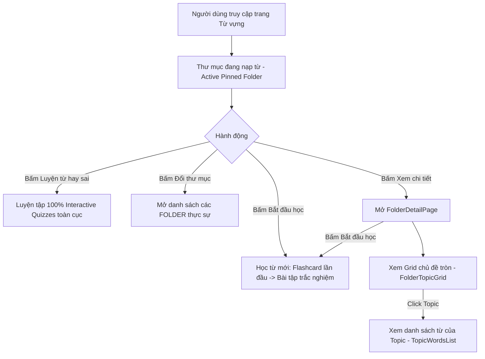

# Vocabulary System Architecture & Study Flow

Tài liệu chuẩn hóa kiến trúc hệ sinh thái Từ vựng (Vocabulary), phân định rõ ràng giữa **Folder & Topic (Phạm vi nạp từ - Intake Scope)** và **Spaced Repetition Toàn Cục (Global Review)**, quy chuẩn cấu trúc cơ sở dữ liệu, phân rã Component kiến trúc và luồng học (Study Flow).

---

## 1. Định nghĩa Khái niệm Cốt lõi

### 1.1. Folder (Thư mục từ vựng) - Phạm Vi Nạp Từ Mới (Intake Scope Boundary)

- **Bản chất**: Là đơn vị nhóm từ vựng cấp cao nhất phục vụ cho việc **giới hạn phạm vi nạp từ mới (Intake Scope)** trong một khoảng thời gian nhất định (ví dụ: Thư mục 600 từ vựng cốt lõi TOEIC, Thư mục CEFR A1/B1, hoặc Thư mục cá nhân do người dùng tạo).
- **Không tạo ốc đảo cô lập (Anti-Silos)**:
  - Folder không phải là một "hộp đóng kín" mà chỉ giúp người học khoanh vùng mục tiêu học theo lộ trình.
  - Sau khi các từ trong Folder được người dùng học và ghi nhận tiến độ (`level >= 1`), các từ này hòa nhập vào vốn từ vựng toàn cục của tài khoản.
  - Quá trình ôn tập định kỳ (Spaced Repetition) và rèn luyện từ hay sai (Frequently Missed Words) diễn ra liên tục trên toàn bộ vốn từ, không bị cô lập theo folder.

### 1.2. Topic (Chủ đề) - Đơn vị Hiển thị & Lọc theo Ngữ Cảnh (View/Filter Only)

- **Bản chất**: Là thuộc tính metadata phân loại được lưu trữ trực tiếp trong cơ sở dữ liệu (`vocab_words.topic`, `vocab_words.topicVi`, `vocab_words.topicImageUrl`).
- **Mục đích**: **CHỈ PHỤC VỤ MỤC ĐÍCH XEM, LỌC VÀ NẠP THEO CHỦ ĐỀ (View / Filter / Thematic Intake)**:
  - Cho phép người dùng duyệt từ vựng theo nhóm chuyên đề để tra cứu.
  - Xem danh sách từ vựng được nhóm theo Topic trong trang chi tiết Folder ([FolderDetailPage]).
  - Hiển thị avatar tròn minh họa chủ đề kèm vòng tiến độ ghi nhớ (Circular Progress Ring).
- **Ranh giới nghiêm ngặt**:
  - Topic **KHÔNG PHẢI** là một Folder.
  - Không bao giờ hiển thị Topic thành các Folder riêng lẻ trong giao diện "Đổi thư mục" (Switch Folder).
  - Tất cả tên chủ đề tiếng Anh, tên tiếng Việt và link ảnh minh họa được cung cấp 100% từ Database/API, tuyệt đối không hardcode file mapping ở client.

### 1.3. Vai Trò Của Flashcard vs. Bài Tập Tương Tác

- **Flashcard**: CHỈ xuất hiện khi lần đầu tiên gặp từ mới (`level === 0, learningStep === 0`) nhằm giúp người học làm quen với từ, nghe phát âm US/UK, đọc ví dụ và **tự đánh giá để chọn mức xuất phát điểm** (1: Thông thạo ngay $\rightarrow$ Level 5; 3: Nhớ tạm $\rightarrow$ Level 2; Enter: Chưa biết $\rightarrow$ Level 0).
- **Bài tập tương tác (Mini-Games/Quizzes)**: Toàn bộ các vòng học tiếp theo, vét hàng đợi, ôn tập từ hay sai và ôn tập Spaced Repetition **100% sử dụng bài tập tương tác** (Trắc nghiệm chọn từ, trắc nghiệm chọn nghĩa, gõ chính tả), TUYỆT ĐỐI KHÔNG dùng Flashcard.

---

## 2. Quy chuẩn Luồng Học (Study Flow)



### 2.1. Active Pinned Folder (Thư mục ghim đang nạp từ)

- Người dùng ghim **1 Thư mục trọng tâm** để tập trung nạp từ trong giai đoạn hiện tại.
- **Hàng nút điều khiển**:
  - **`[ Học từ mới ]`** (`StudySessionMode.LEARN_NEW`): Nạp từ mới của Pinned Folder.
  - **`[ Luyện tập ]`** (`StudySessionMode.PRACTICE`):
    - Khi `dueCount > 0`: Mở bài tập tương tác (100% quizzes) cho các từ đến hạn.
    - Khi `dueCount === 0`: Tự động chuyển nhãn/trạng thái thành "Học từ mới" để tiếp tục nạp từ.
  - **`[ Thẻ ghi nhớ ]`** (`StudySessionMode.FLASHCARD`): Ôn lướt flashcard 2 nút [Ôn lại] / [Đã thuộc].

### 2.2. Frequently Missed Words (Từ hay sai toàn cục)

- Widget "Từ hay sai" trên Dashboard tổng hợp các từ người dùng học gần đây có tỷ lệ lỗi cao nhất trên **toàn bộ tài khoản**, không giới hạn theo Folder đang ghim.
- **2 nút hành động song song**:
  - **`[ Luyện tập ]`** (`StudySessionMode.PRACTICE`): Luyện tập 100% bài tập tương tác (trắc nghiệm, điền từ) không có flashcard.
  - **`[ Thẻ ghi nhớ ]`** (`StudySessionMode.FLASHCARD`): Ôn lướt thẻ flashcard với 2 nút [Ôn lại] (giảm hoa) và [Đã thuộc] (tăng hoa).


### 2.3. Switch Folder (Đổi thư mục)

- Khi bấm "Đổi thư mục": Giao diện **CHỈ HIỂN THỊ CÁC FOLDER LỚN**:
  1. Các Thư mục hệ thống (ví dụ: Thư mục 600 từ vựng TOEIC, Thư mục CEFR).
  2. Các Thư mục cá nhân do người dùng tự tạo.
- **Nghiêm cấm**: Hiển thị danh sách 50 topic con (như Trains, Eating Out, Shipping) trong modal đổi thư mục.

### 2.4. Folder Detail & Topic Viewing

- Trong trang xem chi tiết Folder ([FolderDetailPage]):
  - Chế độ 1: Grid các chủ đề tròn ([FolderTopicGrid]) với ảnh minh họa, tên Việt/Anh, số từ đã thuộc / tổng số từ, và vòng tiến độ SVG tròn.
  - Chế độ 2: Danh sách từ vựng ([TopicWordsList]) khi bấm vào 1 chủ đề cụ thể để nghe phát âm US/UK, xem nghĩa và câu ví dụ.
  - Nút hành động nổi dính đáy ([StudyBottomActionBar]) kích hoạt phiên học nạp từ.

---

## 3. Cấu trúc Dữ liệu & Backend Mapping

### 3.1. Database Schema

- `vocab_folders`: Đại diện cho Thư mục học tập (`id`, `name`, `description`, `authorId`, `category`).
- `vocab_words`: Chứa thông tin từ vựng:
  - `topic`: Tên chủ đề tiếng Anh (ví dụ: `"Contracts"`, `"Salaries & Benefits"`, `"Banking"`...).
  - `topicVi`: Tên chủ đề tiếng Việt chuẩn có dấu (ví dụ: `"Hợp đồng & Pháp lý"`, `"Lương bổng & Đãi ngộ"`...).
  - `topicImageUrl`: Link ảnh minh họa chủ đề được lưu trữ trên Cloudinary CDN.
  - `phonetic`, `phoneticUs`, `phoneticUk`, `audioUrl`, `audioUsUrl`, `audioUkUrl`, `imageUrl`.
- `vocab_definitions`: Chứa định nghĩa đa ngôn ngữ (`definition.vi`, `definition.en`) và loại từ (`partOfSpeech`).
- `vocab_examples`: Chứa câu ví dụ song ngữ (`sentence.en`, `sentence.vi`).
- `vocab_flashcards`: Khóa ngoại trỏ trực tiếp đến Folder chứa từ vựng đó.

### 3.2. Data Seeding Standard

- Toàn bộ từ TOEIC được seed trực tiếp qua script backend (`backend/src/seed-toeic.ts`), lưu trữ toàn bộ metadata (`topic`, `topicVi`, `topicImageUrl`) vào Neon PostgreSQL.
- Frontend hoàn toàn không chứa bất kỳ file mapping tĩnh nào (đã xóa sạch các file `toeic-topics.ts`, `toeic-topics-vi.ts`, `toeic-topic-images.ts`).

---

## 4. Kiến trúc Frontend Components & Quy chuẩn AGENTS.md

Tất cả các file component và hook tuân thủ nghiêm ngặt quy định:

- **Giới hạn số dòng**: Mỗi file component/page đều **dưới 300 dòng**.
- **Không dùng kiểu `any`**: 100% sử dụng TypeScript interface / type an toàn.
- **Tên biến tường minh**: Không dùng biến 1 chữ cái (`e`, `p`, `m`), luôn dùng tên tường minh (`event`, `player`, `index`, `example`).
- **Portal Stack**: Modal/Dialog/Full-screen view (như `StudyView`, `StudySettingsDialog`, `MasteryFlowerDialog`) mount qua hệ thống Portal stack (`usePortal`, `usePortalWithoutBackdrop`).
- **Design System Subtle Styling**:
  - Các nút điều khiển thanh công cụ sử dụng `Button variant="subtle"` không viền.
  - Thẻ Flashcard sử dụng `bg-card/90 backdrop-blur-md shadow-sm` không dùng border cứng.
  - Không gian học bổ sung dải sáng ambient glow (`bg-primary/20 blur-[120px]`) đồng nhất với Layout chính.

### 4.1. Cấu trúc thư mục Module Vocabulary

```
src/features/vocabulary/
├── components/
│   ├── cards/                    # Các card widget trên Dashboard
│   ├── dialogs/                  # Dialog tạo thư mục, cấu hình
│   ├── folder-detail/            # Component tách nhỏ của trang chi tiết thư mục
│   │   ├── folder-topic-grid.tsx # Grid các chủ đề tròn & tiến độ (<= 170 dòng)
│   │   └── topic-words-list.tsx  # Danh sách từ trong chủ đề (<= 160 dòng)
│   ├── mastery/                  # Widget đo lường độ thông thạo & hoa cúc
│   └── study/                    # Bộ giao diện phiên học
│       ├── study-view.tsx        # View toàn màn hình của phiên học
│       ├── study-flashcard.tsx   # Thẻ flashcard 3D lật 2 mặt chi tiết
│       ├── study-settings-dialog.tsx
│       └── study-bottom-action-bar.tsx
├── hooks/
│   ├── use-study-session.ts      # Quản lý dynamic queue học (< 300 dòng)
│   ├── use-study-shortcuts.ts    # Quản lý phím tắt bàn phím độc lập
│   ├── use-study-session.types.ts# Kiểu dữ liệu phiên học
│   └── use-study-settings.ts
└── pages/
    ├── folder-list-page.tsx      # Trang danh mục thư mục & dashboard học
    └── folder-detail-page.tsx    # Trang chi tiết thư mục (< 180 dòng)
```
