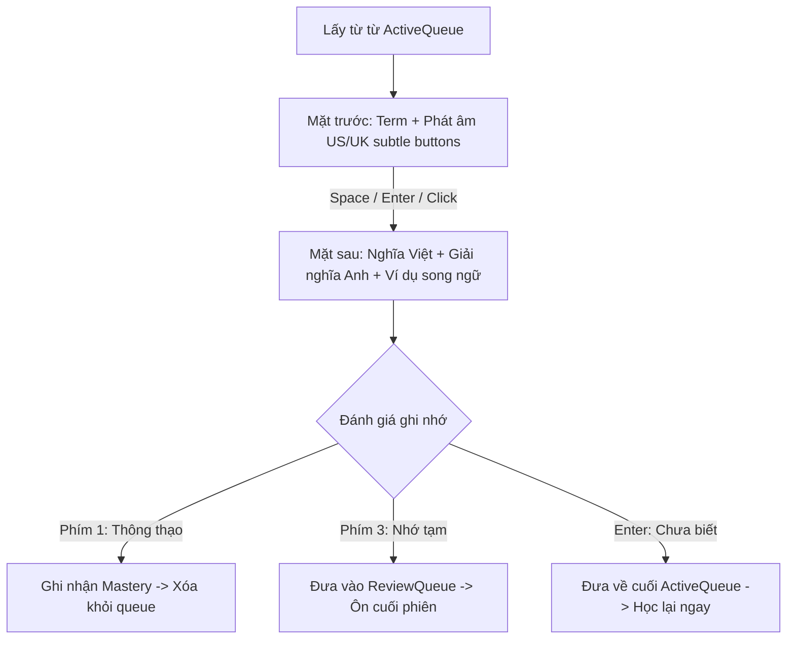

# Đặc Tả Kiến Trúc & Luồng Học Từ Vựng (Vocabulary Learning Flow Specification)

Tài liệu quy chuẩn luồng học từ vựng thông minh theo cơ chế **Dynamic Learning Queue** (tương tự mô hình Lingoland/Duolingo/Anki) tích hợp cho nền tảng Lumen.

---

## 1. Khởi tạo phiên học & Lọc danh sách từ (Word Pool)

### Trường hợp A: Bấm Learn tại Folder (Thư mục chính)
* **Phạm vi gom từ**: Gom toàn bộ từ vựng thuộc tất cả các topic con nằm trong Folder đó.
* **Xử lý**: Trộn ngẫu nhiên (shuffle) toàn bộ danh sách.
* **Quota mục tiêu ($N$)**: Rút ra đúng số lượng từ mục tiêu theo cấu hình bài học của người dùng:
  * **A few**: 7 - 10 câu ($N = 7$ từ gốc)
  * **Moderate**: 10 - 15 câu ($N = 10$ từ gốc)
  * **Many**: 15 - 20 câu ($N = 15$ từ gốc)
  * **A lot**: 20 - 26 câu ($N = 20$ từ gốc - Mặc định)

### Trường hợp B: Bấm Learn tại 1 Topic cụ thể (Chuyên đề)
* **Ưu tiên 1**: Lấy toàn bộ từ vựng thuộc Topic hiện tại trực tiếp theo `card.topic`.
* **Phạm vi**: Học tập trung toàn bộ danh sách từ của chủ đề được chọn.

---

## 2. Cơ chế Dynamic Learning Queue (Hàng Đợi Học Linh Hoạt)

Mỗi phiên học vận hành dựa trên **2 hàng đợi độc lập**:
1. **`ActiveQueue`**: Hàng đợi các từ đang học trong vòng lặp hiện tại.
2. **`ReviewQueue`**: Hàng đợi gom các từ trả lời "Nhớ tạm" (Phím 3) hoặc "Chưa biết" (Enter) cần học lặp lại.

### Quy tắc hiển thị bước học (Progress Range)
* Bộ đếm thanh tiến độ header tính toán tỷ lệ từ hoàn thành (`masteredIds.length / poolCards.length * 100`).
* Độ dài thực tế của phiên học phụ thuộc vào mức độ thuộc từ của người dùng. Từ đánh dấu "Chưa biết" sẽ được đưa về cuối hàng đợi để kiểm tra lại ngay trong phiên.

---

## 3. Vòng Lặp Học Từng Thẻ (Step-by-Step Flashcard Interaction)

Ở mỗi bước, hiển thị thẻ đầu tiên trong `ActiveQueue` ([StudyFlashcard]):

### 3.1. Mặt trước Flashcard (Front Side)
* Hiển thị từ vựng (`term`) kiểu chữ đậm rõ nét.
* Nút phát âm US và UK kiểu `subtle` (không viền, nền trong suốt, hover làm nổi bật).
* Gợi ý thao tác lật thẻ: "Lật - Nhấn Space".

### 3.2. Mặt sau Flashcard (Back Side - Detailed Explanation)
* **Từ vựng & Loại từ**: `term` kèm badge phân loại (`n.`, `v.`, `adj.`...).
* **Nghĩa tiếng Việt**: Chữ to, đậm, rõ ràng (lấy từ `definition.vi`).
* **Giải nghĩa tiếng Anh**: Định nghĩa nguyên bản tiếng Anh (`definition.en`) giúp hiểu sâu ngữ cảnh.
* **Hộp ví dụ thực tế song ngữ**:
  * Câu tiếng Anh in nghiêng (`example.sentence.en`).
  * Dịch nghĩa tiếng Việt bên dưới (`example.sentence.vi`).
* Ảnh minh họa từ vựng (nếu có) hiển thị gọn gàng.

### 3.3. Các phím tắt thao tác (Keyboard Shortcuts)
* `Space`: Lật qua lại giữa 2 mặt của thẻ.
* `1`: Đánh giá **Thông thạo** (Mastered).
* `3`: Đánh giá **Nhớ tạm** (Review).
* `Enter`: Đánh giá **Chưa biết** (Again - khi đang ở mặt sau) hoặc Lật thẻ (khi ở mặt trước).
* `U`: Phát âm giọng Mỹ (US).
* `K`: Phát âm giọng Anh (UK).
* `Escape`: Thoát phiên học.

---

## 4. Giai đoạn Vét Hàng Đợi (Review Phase)

* Khi `ActiveQueue` rỗng:
  1. Hệ thống kiểm tra `ReviewQueue`.
  2. **Nếu `ReviewQueue` còn từ**:
     * Chuyển toàn bộ các từ trong `ReviewQueue` thành `ActiveQueue` mới.
     * Tiêu đề trên thẻ chuyển thành **"Từ ôn tập"**.
     * Lặp lại cho đến khi người dùng thông thạo toàn bộ.
  3. **Nếu `ReviewQueue` rỗng**:
     * Toàn bộ từ trong quota đã được ghi nhớ $\rightarrow$ Chuyển sang màn hình Tổng kết ([StudyCompleted]).

---

## 5. Kết Thúc Phiên Học (Session Completion)

1. **Thống kê chi tiết**:
   * Số lượng từ hoàn thành trong phiên.
   * Danh sách các từ người dùng bấm "Chưa biết" nhiều lần nhất kèm số lần sai để theo dõi.
2. **Cập nhật dữ liệu (Persistence)**:
   * Gửi kết quả đánh giá thẻ về backend API (`POST /vocabulary/flashcards/:id/review`).
   * Hệ thống cập nhật cấp độ bông hoa ghi nhớ (Spaced Repetition Mastery 1-5).
