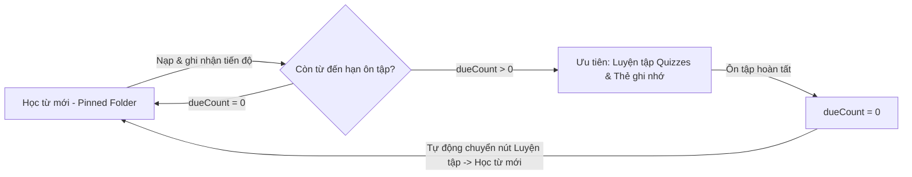

# Đặc Tả Kiến Trúc & Luồng Học Từ Vựng (Vocabulary Learning Flow Specification)

Tài liệu quy chuẩn luồng học từ vựng thông minh theo cơ chế **Dynamic Learning Queue** kết hợp **Spaced Repetition** tích hợp cho nền tảng Lumen.

---

## 1. Triết Lý Cốt Lõi: Intake Scope vs. Continuous Review

### 1.1. Bản chất của Folder & Topic: Phạm Vi Nạp Từ Mới (Intake Boundary / Scope)

- **Không tạo ốc đảo cô lập (Anti-Silos)**: Hệ thống từ vựng không phân chia cô lập theo kiểu "từ của folder nào chỉ được học và ôn trong folder đó".
- **Vai trò của Folder & Topic**:
  - Đóng vai trò là **giới hạn phạm vi nạp từ mới (Intake Scope)** trong một khoảng thời gian nhất định (ví dụ: người dùng đặt mục tiêu nạp bộ từ TOEIC 600 trong tháng này, hoặc học chuyên đề Hợp đồng trong tuần này).
  - Giúp người học không bị ngợp và định hình lộ trình rõ ràng khi bắt đầu tiếp cận khối lượng từ vựng mới.
- **Tính liên tục của Spaced Repetition (Global Review)**:
  - Một khi một từ vựng đã được nạp vào trí nhớ (`level >= 1` hoặc đã qua bước thiết lập ban đầu), từ đó trở thành một phần trong vốn từ vựng toàn cục của người dùng.
  - Chu trình ôn tập định kỳ (Spaced Repetition Review) và luyện tập phản xạ diễn ra liên tục, tổng hợp xuyên suốt toàn bộ các từ đã học, không bị rào cản bởi ranh giới folder.

### 1.2. Vai Trò Của Flashcard vs. Bài Tập Tương Tác (Interactive Games / Quizzes)

Hệ thống phân định rạch ròi 2 hình thức tương tác theo từng giai đoạn nhận thức của người học:

1. **Flashcard (Thẻ 2 mặt chi tiết) — Cổng Nạp Đầu Vào (First-Time Onboarding Gate Only)**:
   - **Chỉ xuất hiện DUY NHẤT một lần** khi người học lần đầu tiên bắt gặp từ mới (`level === 0, learningStep === 0`).
   - **Mục đích**:
     - Cho phép người học khám phá từ: xem cách viết, nghe phát âm chuẩn US/UK, xem loại từ, nghĩa tiếng Việt, giải nghĩa bản xứ, và câu ví dụ ngữ cảnh song ngữ.
     - **Chọn mức xuất phát điểm (Self-Assessment Baseline)**:
       - **Thông thạo ngay (Phím 1)**: Nếu người học đã biết rõ từ này từ trước $\rightarrow$ Nhảy vọt lên Level 5, không cần học lại các bước cơ bản.
       - **Nhớ tạm (Phím 3)**: Người học đã mang máng biết từ $\rightarrow$ Đưa vào Level 2 để ôn luyện nhanh.
       - **Chưa biết (Enter)**: Người học chưa từng biết từ này $\rightarrow$ Bắt đầu từ Level 0, đưa vào chu trình luyện tập chi tiết.

2. **Bài tập tương tác & Mini-games — Toàn Bộ Chu Trình Luyện Tập & Ôn Tập (Interactive Practice)**:
   - **TUYỆT ĐỐI KHÔNG DÙNG FLASHCARD** cho các phiên sau:
     - Các bước luyện tập tiếp theo trong cùng phiên học.
     - Giai đoạn vét hàng đợi (Queue clearing).
     - **Luyện tập các từ hay sai (Frequently Missed Words)**.
     - Các phiên ôn tập định kỳ Spaced Repetition (Due Review).
   - **Hình thức**: 100% chuyển sang các bài tập tương tác đa giác quan để kích thích phản xạ chủ động (**Active Recall**):
     - Trắc nghiệm chọn nghĩa tiếng Việt (`CHOICE_MEANING`).
     - Trắc nghiệm chọn từ tiếng Anh (`CHOICE_TERM`).
     - Gõ chính tả theo phát âm và ngữ cảnh (`TYPING`).
     - Bài tập ngữ cảnh / điền từ vào câu.

---

# Đặc Tả Kiến Trúc & Luồng Học Từ Vựng (Vocabulary Learning Flow Specification)

Tài liệu quy chuẩn luồng học từ vựng thông minh theo cơ chế **Dynamic Learning Queue** kết hợp **Spaced Repetition** tích hợp cho nền tảng Lumen.

---

## 1. Triết Lý 3 Chế Độ Học & Vòng Lặp Thông Minh (The 3 Study Modes)

Hệ thống phân định rạch ròi 3 chế độ học tập với mục đích nhận thức và giao diện chuyên biệt:

| Tiêu chí                | 1. Học từ mới (`LEARN_NEW`)                                         | 2. Luyện tập (`PRACTICE`)                                                                     | 3. Thẻ ghi nhớ (`FLASHCARD`)                                                                                                                                               |
| :---------------------- | :------------------------------------------------------------------ | :-------------------------------------------------------------------------------------------- | :------------------------------------------------------------------------------------------------------------------------------------------------------------------------- |
| **Bản chất**            | Nạp từ mới từ Pinned Folder kết hợp đan xen ôn từ cũ.               | Luyện phản xạ chủ động (**Active Recall**) cho từ đã học.                                     | Ôn lướt nhanh thẻ nhớ truyền thống cho từ đã học.                                                                                                                          |
| **Flashcard lật 2 mặt** | **Có** (chỉ xuất hiện ở lần đầu gặp từ mới để chọn xuất phát điểm). | **TUYỆT ĐỐI KHÔNG CÓ FLASHCARD**.                                                             | **100% FLASHCARD** (không có câu trắc nghiệm hay gõ từ).                                                                                                                   |
| **Bài tập tương tác**   | Có (trắc nghiệm, điền từ củng cố sau flashcard).                    | **100% bài tập**: Chọn từ (`CHOICE_TERM`), Chọn nghĩa (`CHOICE_MEANING`), Điền từ (`TYPING`). | **Không có bài tập tương tác**.                                                                                                                                            |
| **Giao diện đáy**       | 3 nút xuất phát điểm (1: Mastered, 3: Temp, Enter: Unknown).        | Các lựa chọn đáp án trắc nghiệm / bàn phím gõ từ + Drawer giải thích.                         | **2 nút đánh giá tiến độ chu trình hoa**: - **[ Ôn lại ]** (Đỏ): Giảm progress hoa, đưa về cuối queue. - **[ Đã thuộc ]** (Xanh): Tăng progress hoa, hoàn thành thẻ. |
| **Nguồn từ**            | Pinned Folder (ưu tiên từ chưa học `level === 0`).                  | Từ đến hạn ôn (`Due Cards`) hoặc Từ hay sai (`Missed Words`).                                 | Từ đến hạn ôn (`Due Cards`) hoặc Từ hay sai (`Missed Words`).                                                                                                              |

---

## 2. Quy Tắc Vòng Lặp Học Tập Khép Kín (Learning Cycle State Machine)

Học từ vựng là một chu trình liên tục giữa **Nạp mới** và **Bảo tồn trí nhớ**:

- **Quy tắc chuyển đổi nút thông minh**:
  - Khi còn từ cần luyện tập (`dueCount > 0`): Nút **Luyện tập** hiển thị nổi bật kèm số lượng từ cần ôn (ví dụ: `Luyện tập • 12`).
  - Khi đã luyện tập hết các từ cần ôn (`dueCount === 0`): Nút Luyện tập tự động chuyển trạng thái/nhãn thành **"Học từ mới"** (hoặc hiển thị huy hiệu "Đã hoàn thành ôn tập" và chuyển trọng tâm CTA sang nạp từ mới từ Pinned Folder).

---

## 3. Đặc Tả Chi Tiết Từng Chế Độ

### 3.1. Chế độ 1: Học từ mới (`LEARN_NEW`)

- Bắt đầu bằng Flashcard lật 2 mặt cho các từ mới hoàn toàn (`level === 0, learningStep === 0`):
  - Phím `Space`: Lật thẻ.
  - Phím `1`: Đánh dấu **Thông thạo ngay** $\rightarrow$ Level 5.
  - Phím `3`: Đánh dấu **Nhớ tạm** $\rightarrow$ Level 2.
  - Phím `Enter`: Đánh dấu **Chưa biết** $\rightarrow$ Level 0.
- Các bước sau đó đan xen bài tập tương tác (trắc nghiệm, điền từ) cho từ mới và một số từ cũ để củng cố ghi nhớ dài hạn.

### 3.2. Chế độ 2: Luyện tập (`PRACTICE`)

- **100% là bài tập tương tác / mini-games**:
  - `CHOICE_TERM`: Cho nghĩa tiếng Việt $\rightarrow$ Chọn từ tiếng Anh đúng trong 4 đáp án.
  - `CHOICE_MEANING`: Cho từ tiếng Anh $\rightarrow$ Chọn nghĩa tiếng Việt đúng.
  - `TYPING`: Cho phát âm, ngữ cảnh và loại từ $\rightarrow$ Gõ chính xác từ tiếng Anh.
- Trả lời đúng $\rightarrow$ Tăng bước tiến độ mầm cây $\rightarrow$ Chuyển câu tiếp theo.
- Trả lời sai $\rightarrow$ Mở drawer sửa sai $\rightarrow$ Đưa từ vào cuối hàng đợi để kiểm tra lại phản xạ ngay trong phiên.

### 3.3. Chế độ 3: Thẻ ghi nhớ (`FLASHCARD`)

- **Giao diện chuyên biệt cho ôn lướt nhanh**:
  - Header: Tiêu đề phiên học + Biểu tượng **Sunflower / Plant Mastery Ring** (thể hiện tiến độ mầm cây/hoa hiện tại của từ).
  - Center: Thẻ Flashcard 2 mặt (Mặt trước: từ, phát âm US/UK kèm audio, gợi ý phím Space; Mặt sau: giải nghĩa tiếng Việt, nghĩa tiếng Anh, ví dụ ngữ cảnh song ngữ).
  - Bottom Action Bar (luôn hiển thị rõ ràng):
    - **Nút đỏ `[ Ôn lại ]`** (Phím `1` / `Enter`): Bấm khi quên từ $\rightarrow$ Giảm bước tiến độ hoa, đưa thẻ về cuối hàng đợi để ôn lại, gửi API review `isCorrect: false`.
    - **Nút xanh `[ Đã thuộc ]`** (Phím `2` / `3`): Bấm khi đã thuộc $\rightarrow$ Tăng bước tiến độ hoa, hoàn thành thẻ và loại khỏi hàng đợi, gửi API review `isCorrect: true`.

---

## 4. Đồng Bộ Dữ Liệu & Hoàn Thành (Persistence & Completion)

1. **Gửi kết quả đánh giá**: Gửi qua API `POST /api/vocabulary/words/flashcards/review` cập nhật Spaced Repetition mastery.
2. **Tổng kết phiên**: Hiển thị bảng tổng kết số từ đã thuộc, số từ cần rèn luyện thêm, và cập nhật trạng thái vòng lặp về Dashboard.
